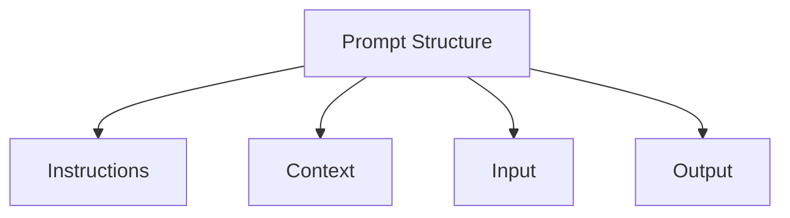
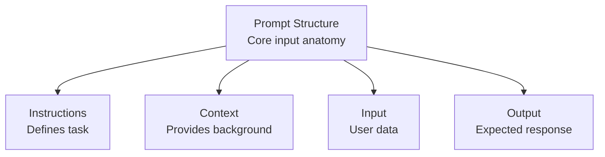
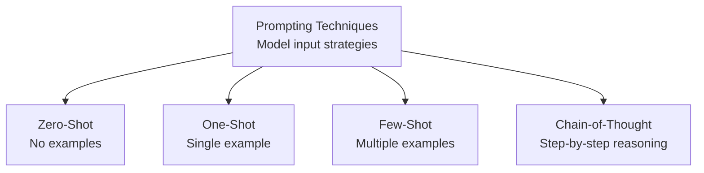
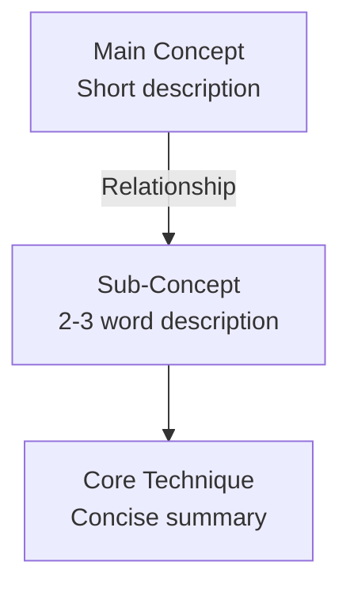

# Course Recap Skill: `course-recap`

## Overview
This skill guides the synthesis of raw academic course and lecture slide content into a clear, high-yield educational recap.

## Required Outputs
Every recap produced using this skill MUST include strictly two sections:
1. **Topic-by-Topic Course Summary**
2. **Concept Relationship Diagram (Mermaid)**

No other sections (such as quizzes, flashcards, cheat sheets, or practice problems) are permitted.

---

## Detailed Topic-by-Topic Course Summary Guidelines
Organize the course content logically by topic or module based on the source text:
- **Topic Title**: Clear, descriptive heading for the module or topic.
- **Core Explanation**: In-depth conceptual breakdown explaining the mechanisms, logic, and theory.
- **Key Definitions & Principles**: Essential terminology, governing formulas, rules, or architectural components directly referenced in the material.
- **Practical Implications & Applications**: How the topic applies in real-world engineering, scientific, or practical scenarios.

Ensure thorough coverage of all significant topics covered in the lecture without skipping key technical details.

---

## Concept Relationship Diagram (Mermaid) Guidelines
Construct a valid Mermaid diagram visualizing the conceptual architecture:
- Use `flowchart TD` (or `graph TD`).
- Connect topics according to their logical dependencies, conceptual prerequisites, and structural hierarchy.
- Use directional arrows with descriptive labels where helpful.

### Diagram Design Goal: Quick-Revision Visual
The diagram should function as a **QUICK-REVISION VISUAL**. A learner who has very little time should be able to look at the diagram and immediately understand:
- What the major concept is
- What its important components, methods, and types are
- What each component means and does
- How concepts are related and ordered
- What the key distinctions between concepts are

The diagram must communicate BOTH:
1. **Concept structure**
2. **Concept meaning**

Do NOT make the diagram merely a bare list of topic names.

### Node Label Format
For all important concepts, components, techniques, methods, and processes, use multiline node labels with a concise description:

```
NodeID["Concept Name<br/>Short 2–3 word description"]
```

The concept title appears on the top line, and the short description appears directly below it via `<br/>`.

### Description Rules
1. **Word Count**: Descriptions should normally be **2–3 words** (maximum 4 words only when strictly necessary for clarity).
2. **Visual Distinction**: Keep the concept name and description visually distinct using `<br/>` inside double quotes.
3. **Core Role & Meaning**: The description must concisely summarize the essential meaning, role, purpose, characteristic, or distinction of the concept.
4. **Source Ground Truth**: Derive descriptions **ONLY** from the uploaded course material. Do NOT invent facts, definitions, or explanations not present in the source.
5. **No Clutter or Paragraphs**: Do NOT copy long sentences, paragraphs, or verbose definitions into nodes.
6. **Selective Application**: Apply descriptions to important concepts, components, methods, types, processes, and relationships. Do not turn every minor detail or sentence into an individual node. Keep the diagram clean and readable.

### Contrast Examples

**Instead of bare topic names (Avoid):**


**Use descriptive nodes with 2–3 word summaries (Required):**


**Technique comparison example:**


### Syntax Safety Rules
- Enclose node labels in double quotes inside brackets: `id["Concept Name<br/>2–3 word description"]`.
- Ensure all node IDs are unique and alphanumeric (e.g., `A`, `B1`, `ZeroShot`).
- Avoid unescaped special characters outside of quotes.
- Always use `flowchart TD`.

---

## Output Structure Format
Produce clean GitHub-flavored Markdown:

```markdown
# [Course / Lecture Title] - Comprehensive Course Recap

## Course Overview
[Brief 2-3 paragraph synthesis of course scope, main objective, and overarching themes]

## Topic-by-Topic Course Summary

### 1. [Topic One Name]
**Overview & Mechanisms:**
...
**Key Definitions & Principles:**
...
**Practical Implications:**
...

### 2. [Topic Two Name]
...

---

## Concept Relationship Diagram


```

