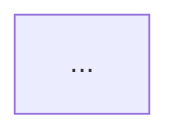

# Course Recap Skill: `course-recap`

## Overview
This skill guides the synthesis of raw academic course and lecture slide content into a clear, high-yield educational recap.

## Required Outputs
Every recap produced using this skill MUST include strictly two sections:
1. **Topic-by-Topic Course Summary**
2. **Concept Relationship Diagram (Mermaid)**

No other sections (such as quizzes, flashcards, cheat sheets, or practice problems) are permitted.

---

## Detailed Topic-by-Topic Course Summary Guidelines
Organize the course content logically by topic or module based on the source text:
- **Topic Title**: Clear, descriptive heading for the module or topic.
- **Core Explanation**: In-depth conceptual breakdown explaining the mechanisms, logic, and theory.
- **Key Definitions & Principles**: Essential terminology, governing formulas, rules, or architectural components directly referenced in the material.
- **Practical Implications & Applications**: How the topic applies in real-world engineering, scientific, or practical scenarios.

Ensure thorough coverage of all significant topics covered in the lecture without skipping key technical details.

---

## Concept Relationship Diagram (Mermaid) Guidelines
Construct a valid Mermaid diagram visualizing the conceptual architecture:
- Use `flowchart TD` (or `graph TD`).
- Connect topics according to their logical dependencies, conceptual prerequisites, and structural hierarchy.
- Use directional arrows with descriptive labels where helpful:
  ```mermaid
  flowchart TD
      A["Foundational Concept"] -->|Prerequisite for| B["Core Technique"]
      B -->|Implemented by| C["Practical Application"]
      B -->|Optimized via| D["Advanced Strategy"]
  ```
- **Syntax Safety Rules**:
  - Enclose node labels in double quotes inside brackets: `id["Concept Name"]`.
  - Avoid special characters outside of quotes.
  - Ensure all node IDs are unique and alphanumeric.

---

## Output Structure Format
Produce clean GitHub-flavored Markdown:

```markdown
# [Course / Lecture Title] - Comprehensive Course Recap

## Course Overview
[Brief 2-3 paragraph synthesis of course scope, main objective, and overarching themes]

## Topic-by-Topic Course Summary

### 1. [Topic One Name]
**Overview & Mechanisms:**
...
**Key Definitions & Principles:**
...
**Practical Implications:**
...

### 2. [Topic Two Name]
...

---

## Concept Relationship Diagram


```
