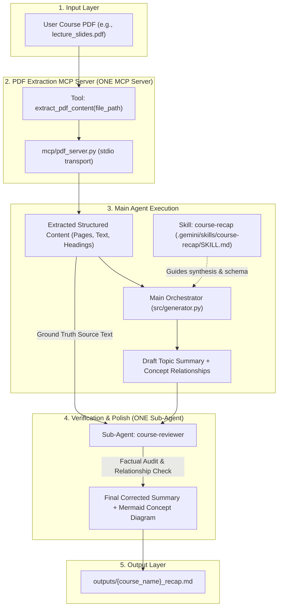

# Course Recap Generator - Implementation Plan

## Goal Description
Build a streamlined, lightweight Python CLI application that transforms real course lecture PDFs into high-yield educational course recaps consisting exclusively of:
1. **A detailed topic-by-topic course summary**
2. **A concept relationship diagram** (rendered in Mermaid syntax)

The system enforces a clean, modular agentic architecture centered on:
- **Exactly ONE MCP Server**: Dedicated exclusively to real PDF text/content extraction.
- **Exactly ONE Custom Reusable Skill**: `course-recap`, defining domain rules and structure for course synthesis and concept graph mapping.
- **Exactly ONE Harness-Defined Sub-Agent**: `course-reviewer`, verifying and refining the draft recap against the extracted source text.

---

## Architectural Constraints & Alignment Matrix

| Constraint | Architectural Decision & Implementation |
|---|---|
| **1. Planning Phase** | Exactly ONE planning phase (this revised plan in `docs/PLAN.md`). No repeated planning loops. |
| **2. MCP Server** | Exactly ONE MCP server in `mcp/pdf_server.py`, exposing tool `extract_pdf_content`. No other MCP servers. |
| **3. Custom Skill** | Exactly ONE custom skill `course-recap` located at `.gemini/skills/course-recap/SKILL.md`. |
| **4. Sub-Agent** | Exactly ONE harness-defined sub-agent `course-reviewer` defined with specialized grounding & audit prompt. |
| **5. Sub-Agent Review** | `course-reviewer` cross-checks draft recap and concept relationships directly against raw extracted PDF text. |
| **6. Workflow Sequence** | `Course PDF` -> `PDF Extraction MCP Server` -> `Extracted Structured Content` -> `Main Agent` (guided by `course-recap` skill) -> `Summary + Concept Relationships` -> `course-reviewer Sub-Agent` -> `Final Corrected Summary + Mermaid Concept Diagram`. |
| **7. Required Outputs** | Strictly a detailed topic-by-topic summary + Mermaid concept diagram in a single clean Markdown file. |
| **8. Out of Scope** | All quizzes, flashcards, cheat sheets, synthetic PDF generators, JSON outputs, heavy test frameworks, Web/UI, RAG/vector DBs, auth, cloud deploy, and databases are completely removed. |
| **9. Interface** | Lightweight Command-Line Interface (CLI) in `src/cli.py`. |
| **10. AI Engine** | Python with the official `google-genai` SDK (`gemini-3.8-flash`). |
| **11. Invocation Docs** | Explicitly documented below for MCP server, skill, and sub-agent. |
| **12. Real PDF Testing** | Tested end-to-end with a real course PDF supplied by the user. |

---

## System Architecture



---

## Component Specifications

### 1. The ONE MCP Server: PDF Content Extraction (`mcp/pdf_server.py`)
- **Protocol**: FastMCP / Model Context Protocol (MCP) over `stdio`.
- **Primary Tool**:
  ```python
  @mcp.tool()
  def extract_pdf_content(file_path: str) -> dict:
      """Extracts text, metadata, page breakdown, and outline structure from a local PDF."""
  ```
- **Return Payload**:
  - `metadata`: Page count, PDF title, author, file size.
  - `pages`: List of `{"page_number": int, "text": str, "character_count": int}`.
  - `full_text`: Aggregated sanitized text.
- **PDF Engine**: Standard robust Python PDF parsing via `pypdf` (zero external binary dependencies).

### 2. The ONE Custom Skill: `course-recap` (`.gemini/skills/course-recap/SKILL.md`)
- **File Location**: `.gemini/skills/course-recap/SKILL.md`
- **Specification**:
  - **Topic Summary Instructions**: Instructs the model to parse educational slide content into modular lecture topics, identifying central principles, technical explanations, mathematical formulations/code where applicable, and real-world significance.
  - **Concept Diagram Guidelines**: Enforces generation of a valid Mermaid diagram (`flowchart TD` or `graph TD`) capturing concept hierarchy, prerequisites, and causal/dependency relationships between topics (e.g., `A[Gradient Descent] --> B[Backpropagation] --> C[Neural Network Training]`).
  - **Strict Boundaries**: Rejects extraneous fluff, quizzes, flashcards, or irrelevant commentary.

### 3. The ONE Harness-Defined Sub-Agent: `course-reviewer`
- **Definition**: Defined in the harness / orchestrator as a specialist verification agent:
  - **Role**: `course-reviewer`
  - **System Prompt**:
    > "You are an expert academic peer-reviewer and fact-checker. Your job is to rigorously review a draft course recap and concept diagram against the source PDF text extracted by the PDF Extraction MCP server. Verify that all definitions and topic explanations are factual and accurate to the source. Verify that every node and relationship in the Mermaid concept diagram exists in the course material, with no hallucinated connections. Make necessary corrections and output the final, polished topic-by-topic summary and verified Mermaid concept diagram."
- **Inputs to Sub-Agent**:
  1. `source_text`: The ground-truth text extracted by the MCP server.
  2. `draft_recap`: The initial recap and Mermaid diagram generated by the main agent.
- **Output of Sub-Agent**: The final corrected topic-by-topic course summary and validated Mermaid diagram.

---

## Detailed End-to-End Invocation Protocol

### Step 1: User runs the CLI
```powershell
python -m src.cli recap data/my_course.pdf
```

### Step 2: Invocating the ONE MCP Server
- `src/extractor.py` launches `mcp/pdf_server.py` as a subprocess via standard MCP client protocol (or directly invokes the MCP tool session).
- Calls `extract_pdf_content(file_path="data/my_course.pdf")`.
- Receives structured document payload with page-by-page extracted text.

### Step 3: Invoking the ONE Custom Skill (`course-recap`)
- The Main Agent loads `.gemini/skills/course-recap/SKILL.md`.
- Applies the skill rules and synthesis instructions to construct the prompt with `extracted_pdf_content`.
- Calls Gemini 3.8 Flash (`gemini-3.8-flash`) via `google-genai` SDK:
  ```python
  client = genai.Client()
  draft_interaction = client.interactions.create(
      model="gemini-3.8-flash",
      input=[
          {"type": "text", "text": skill_prompt},
          {"type": "text", "text": f"Course Source Content:\n{extracted_full_text}"}
      ]
  )
  ```
- Yields: `draft_summary` and `draft_concept_relationships` (Mermaid code).

### Step 4: Invoking the ONE Harness Sub-Agent (`course-reviewer`)
- The orchestrator invokes `course-reviewer` with both the ground-truth extracted text and the draft recap:
  ```python
  reviewer_interaction = client.interactions.create(
      model="gemini-3.8-flash",
      system_instruction=COURSE_REVIEWER_SYSTEM_PROMPT,
      input=[
          {"type": "text", "text": f"SOURCE GROUND TRUTH:\n{extracted_full_text}"},
          {"type": "text", "text": f"DRAFT RECAP TO AUDIT:\n{draft_interaction.output_text}"}
      ]
  )
  ```
- The sub-agent audits accuracy, trims hallucinated connections, verifies Mermaid diagram syntax, and returns the final verified recap.

### Step 5: Saving the Output
- The final recap is written to `outputs/<pdf_stem>_recap.md`.
- The CLI prints a summary status and preview link in the terminal.

---

## Proposed Directory & File Layout

```
Course-Recap-Generator/
├── .gemini/
│   └── skills/
│       └── course-recap/
│           └── SKILL.md              # The ONE custom reusable skill
├── data/                             # User places real course PDF here
├── docs/
│   └── PLAN.md                       # This finalized implementation plan
├── mcp/
│   └── pdf_server.py                 # The ONE MCP server (PDF extraction)
├── outputs/                          # Generated final recaps (*_recap.md)
├── src/
│   ├── __init__.py
│   ├── cli.py                        # Lightweight CLI interface
│   ├── config.py                     # API key & environment settings
│   ├── extractor.py                  # Client interface to PDF MCP server
│   ├── generator.py                  # Main agent & course-reviewer subagent pipeline
│   └── reviewer.py                   # Harness definition for course-reviewer subagent
├── .env.example                      # Template for GEMINI_API_KEY
├── .gitignore                        # Git ignore patterns (.venv, .env, outputs)
└── requirements.txt                  # Minimal dependencies (google-genai, mcp, pypdf)
```

---

## Proposed Changes (File-by-File)

### 1. Configuration & Dependencies
#### [NEW] `requirements.txt`
Strictly minimal:
```text
google-genai>=2.3.0
mcp>=1.0.0
pypdf>=4.0.0
python-dotenv>=1.0.0
```

#### [NEW] `.env.example`
```text
GEMINI_API_KEY=your_gemini_api_key_here
```

#### [NEW] `.gitignore`
Standard exclusions: `.venv/`, `.env`, `__pycache__/`, `outputs/*.md`.

#### [NEW] `src/config.py`
Loads `.env`, resolves `GEMINI_API_KEY`, defines default model `gemini-3.8-flash`.

---

### 2. The ONE MCP Server
#### [NEW] `mcp/pdf_server.py`
Implements the standalone PDF extraction MCP server using FastMCP:
- Exposes `extract_pdf_content(file_path: str)` tool.
- Validates that the file exists and is a readable PDF.
- Extracts text page by page with `pypdf.PdfReader`.
- Returns structured JSON containing page count, text blocks, and full combined text.

---

### 3. The ONE Custom Skill
#### [NEW] `.gemini/skills/course-recap/SKILL.md`
Defines the `course-recap` skill:
- Role and objectives for academic course slide synthesis.
- Section format:
  - **Course Title & High-Level Scope**
  - **Topic-by-Topic Detailed Summary** (Concepts, mechanisms, key definitions, practical implications)
  - **Mermaid Concept Diagram** (Hierarchical graph connecting key topics and dependency paths)
- Mermaid syntax constraints (ensuring clean rendering without syntax errors).

---

### 4. Core Pipeline & Sub-Agent
#### [NEW] `src/extractor.py`
Helper to connect to the PDF Extraction MCP server via stdio transport and execute `extract_pdf_content`.

#### [NEW] `src/reviewer.py`
Harness definition and prompt for the `course-reviewer` sub-agent:
- Verification rubric (faithfulness to source text, elimination of unsubstantiated claims, validation of Mermaid graph structure).

#### [NEW] `src/generator.py`
Orchestrator combining:
1. `extractor.py` (MCP extraction)
2. Main Agent (`course-recap` skill prompt + `gemini-3.8-flash`)
3. `reviewer.py` (`course-reviewer` sub-agent review + `gemini-3.8-flash`)
4. Markdown output generation.

---

### 5. CLI Interface
#### [NEW] `src/cli.py`
Lightweight CLI commands:
- `python -m src.cli recap <pdf_path>`: Runs the full pipeline from PDF to final reviewed recap.
- `python -m src.cli check`: Verifies `GEMINI_API_KEY` and MCP server setup.

---

## Verification Plan

### 1. Environment & Setup Verification
```powershell
python -m venv .venv
.\.venv\Scripts\pip install -r requirements.txt
.\.venv\Scripts\python -m src.cli check
```

### 2. MCP Server Verification
Test that the PDF extraction MCP server runs and extracts content:
```powershell
.\.venv\Scripts\python -c "from mcp.pdf_server import extract_pdf_content; print('MCP Tool registered successfully')"
```

### 3. End-to-End Real Course PDF Testing
The user supplies a real course lecture PDF (e.g. placed in `data/lecture.pdf`).
```powershell
.\.venv\Scripts\python -m src.cli recap data/lecture.pdf
```

**Verification Criteria**:
1. MCP server extracts real text from `data/lecture.pdf`.
2. Main agent synthesizes detailed topic summary and initial concept diagram guided by `course-recap` skill.
3. `course-reviewer` sub-agent verifies draft against extracted ground truth, correcting any inaccuracies.
4. Final output in `outputs/lecture_recap.md` contains:
   - Clean, detailed topic-by-topic summary.
   - Fully valid Mermaid concept diagram (`flowchart TD`).
   - No extraneous features (no quizzes, flashcards, or cheat sheets).
